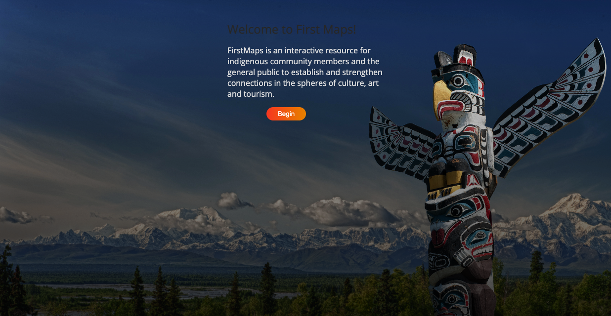
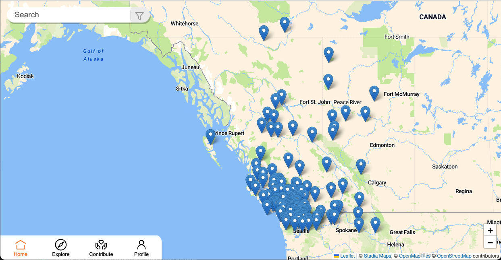
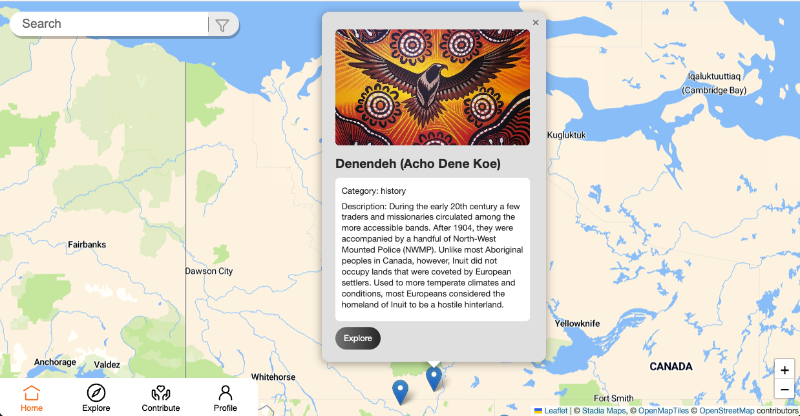
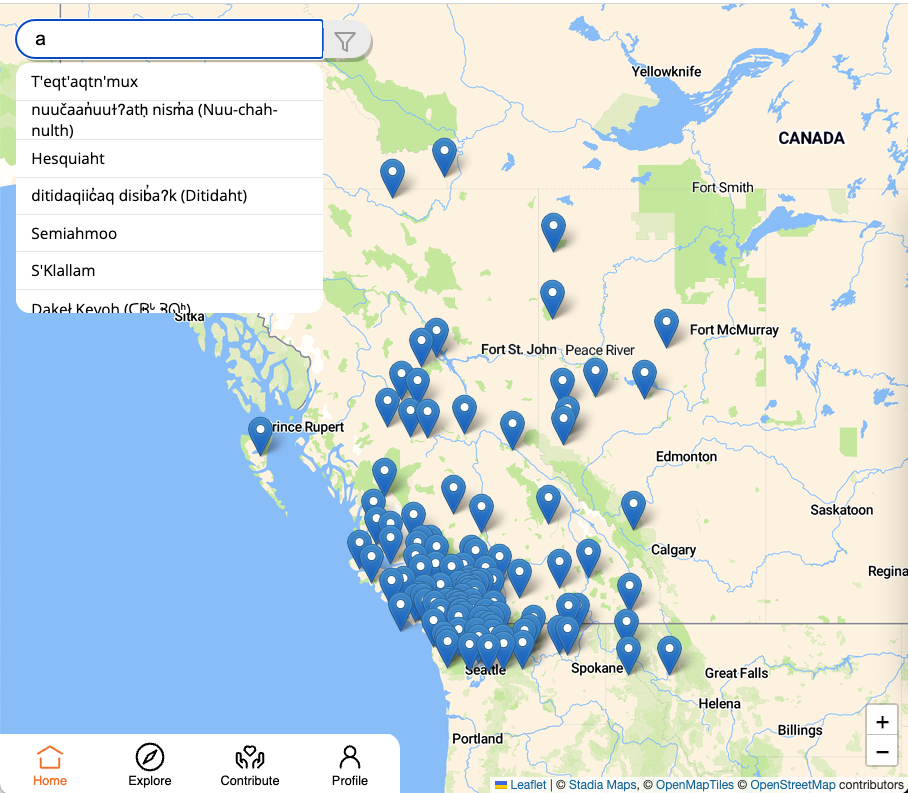
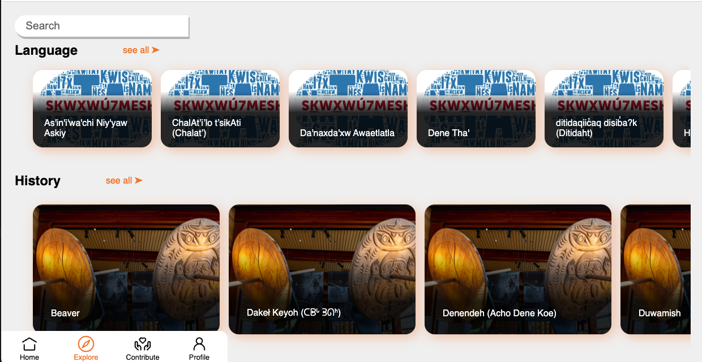
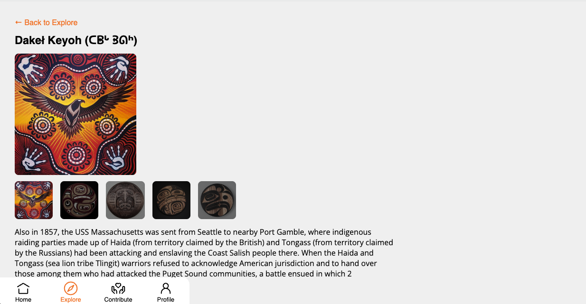
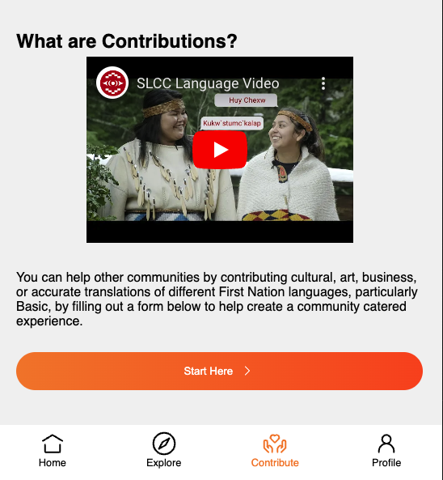
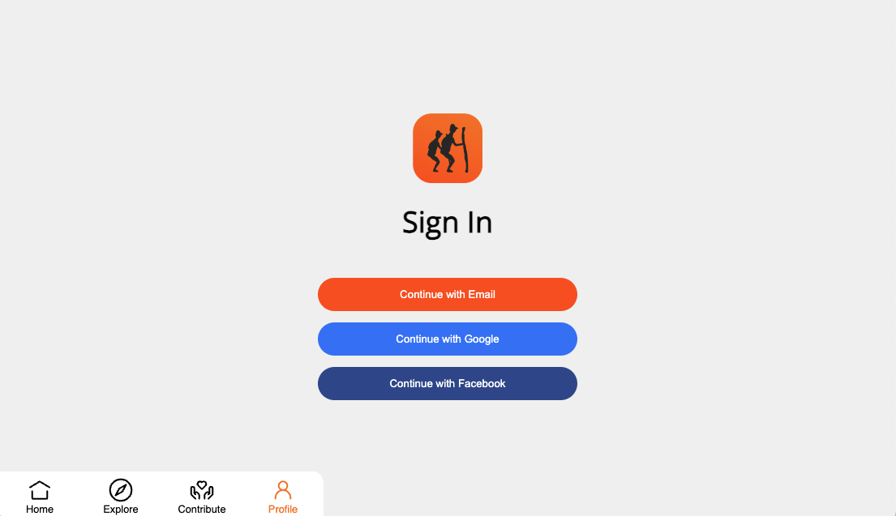
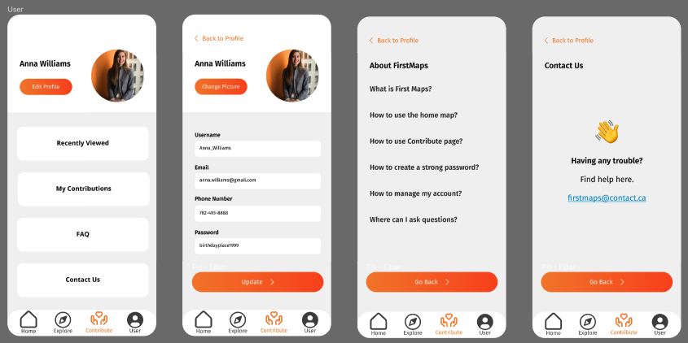

# First Maps

## Introduction

 
**What is First Maps?**

First Maps is an interactive map application for indigenous community members and the general public to establish and strengthen connections in the spheres of culture, art and tourism.
 

**What is our purpose?**

The purpose of First Maps is to allow the native community to showcase aboriginal arts, culture, language and history. Contributing members of the native community can add resources to the app for others to see. This is meant to be a resource for tourists, academics and anyone else who wish to gain a deeper understanding of native culture.
 

## Functionalities

### Map Page

The application serves as a resource for users to find indigenous location of interest. The main page of the application is a map, which shows the locations of various points of interest close to the user (if location is enabled)

 

Users can click on a marker to see the name of the location and a brief description. The user can also click on the "More Info" button to see more information about the location.

 

The search function at the top of the screen allows users to search for a given location by name.

 

### Explore Page

The explore page allows users to see all the locations that are available on the map. The locations are separated by categories. Users can click on a category to see all the locations that are in that category.

 

### Location Page

The location page displays information in more detail about a given location. The user can see the name of the location, a description, the category of the location, and the location on a map. The user can also see the resources that are associated with the location.

 

### Contribution Page

The contribution page allows users to add a new location to the map. The user can enter the name of the location, a description, the category of the location, and the location on a map.

Authentication is required for a user to create a new location. If the user is not logged in, they will be redirected to the login page.

 

### Authentication Page

The application implements third party authentication. It allows users to log into your application using their credentials from a trusted external service like Google, Facebook, or Twitter, instead of creating a new account specifically for your application.

 

### User Profile Page

 

## Tech Stack

**Frontend**
Map: React Leaflet, Open Map Tiles
Framework: React
Styling: Storybook, Styled Components

**Backend**
Auth: Third Party Authentication with NextAuth.js
Server: Next.js
Database: MongoDB with Mongoose as the ORM
 

## Data

The application is seeded with data from the Native-Lands API: <https://native-land.ca/resources/api-docs/>
The API includes locations around the world, however, for demonstration, we only used locations that are within and near the province of British Columbia, Canada.
 

## Known Issues

- Originally the plan was to allow the application to connect to two cloud MongoDB Atlas databases, one for development and one for production. Switching between the two databases should be done using environment variables rathern than a different set of URL paths. This will be fixed in the near future.
